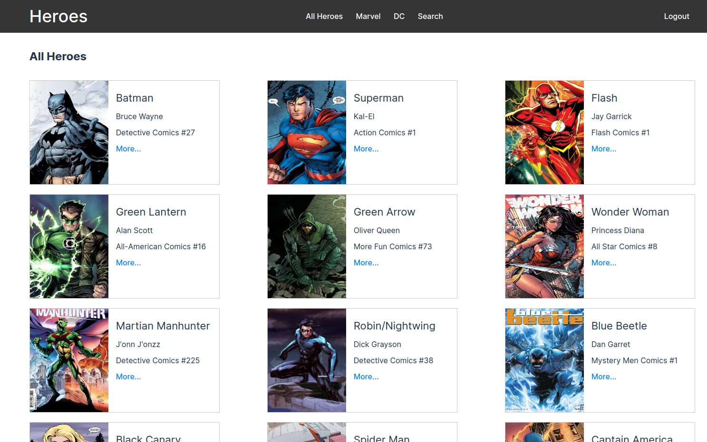
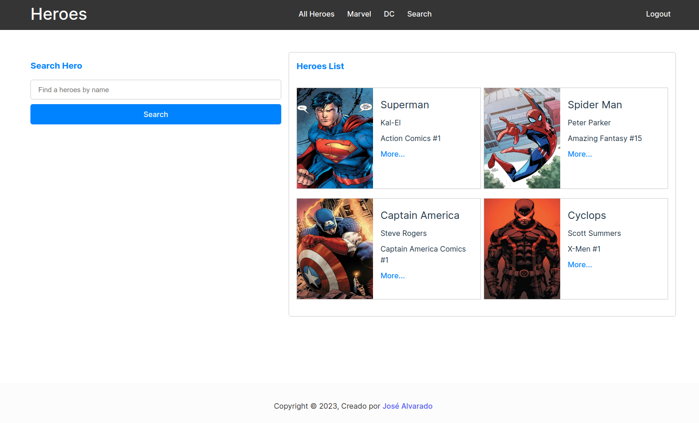
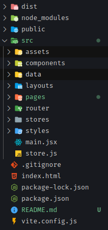

# Heroes App

Heroes App is an application that show very much super heroes of Marvel and DC.

## Tecnologies

- React js
- React Router Dom ^6.8.1
- Zustand State Manager
- React Icons

### Some Screenshots





## Installation

Use the package manager [npm](https://www.npmjs.com/package/npm) to install Heroes App.

```bash
git clone https://github.com/jrag-dev/marvel-dc-heroes-app.git
cd marvel-dc-heroes-app
npm install
```

## Usage

- The data folder works like our api, it contains all the data needed for the app.
- The pages directory contains the different pages of the application.
- The layouts directory contains the public layout of the application.
- The routes directory contains the configuration of the app's routes
- Styles contains the global styles of the app
- Stores contains the different slices for global state management with Zustand State Manager
- The store.js file contains the functions that modify the state, we use Zustand



## Contributing

Pull requests are welcome. For major changes, please open an issue first
to discuss what you would like to change.

Please make sure to update tests as appropriate.

## License

[MIT](https://choosealicense.com/licenses/mit/)
